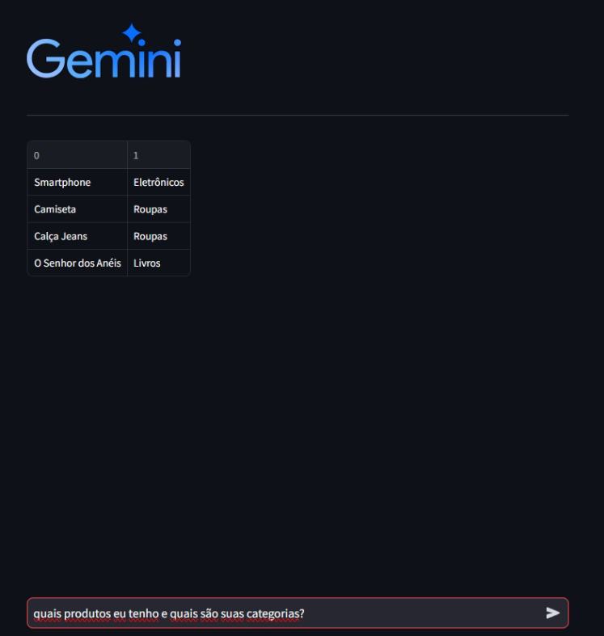

# Projeto AI Gemini

Este é um projeto de demonstração utilizando a API do Google Generative AI & streamlit.

Com esse projeto um usuário mesmo sem conhecimento de linguagem de consulta poderia fazer perguntas em linguagem natural e escolher por exemplo receber um dataset ou uma query.

## Requisitos
    Adicione sua API KEY no arquivo .env

## Instalação

Para iniciar recomendo utilizar a criação de um ambiente virutal executando o comando python abaixo no terminal

```python.exe -m venv .venv```

Para acessar o ambiente virtual criado utilize o comando abaixo:

```.venv/Scripts/activate```

Para instalar as dependências do projeto utilize o comando abaixo:

```pip install -r requirements.txt```

Para iniciar o projeto utilize o comando abaixo:

```streamlit run app.py```

## Como Usar

Acesse no navegador o localhost no link: http://localhost:8501

Basta solicitar uma query ou um dataset e ele irá processar e retornar a resposta.

